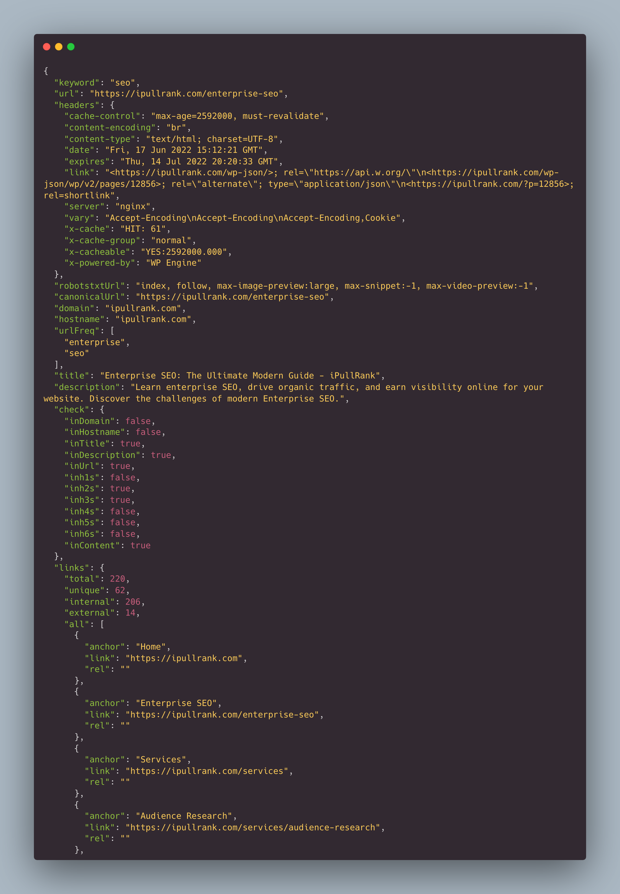

# cf-extraction
Cloudfunction that leverages Puppeteer to extract content and feed into WinkJS for NLP



## Setup and Run

Most of the code is in ```index.js``` but there is a helper classes in ```/helpers``` for puppeteer. 

You should be able to just ```npm install``` and run locally  ```npm start``` but you can also deploy to Google Cloud Function, although I would recommend adding authentication as to not open an endpoint to the world.

Take a look at the [Sample Output](sample.json) for ```https://ipullrank.com/enterprise-seo``` and Keyword SEO

## Contributors
* Mike King @ipullrank
* John Murch @johnmurch
* Shout out to [Wink](https://winkjs.org/) and Mozilla for some awesome code libraries!

## Questions
Questions/Comments/Help Please reach out via twitter @johnmurch or @ipullrank